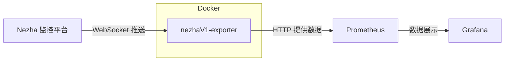
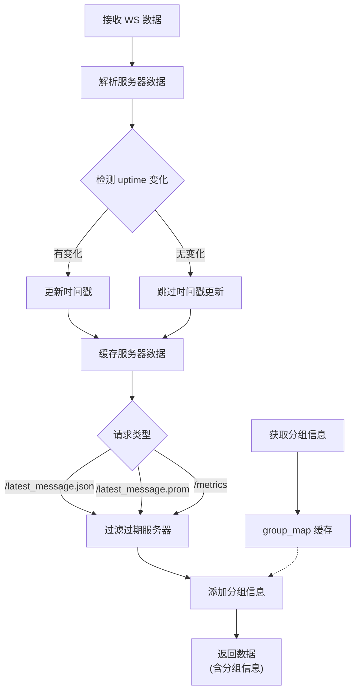

# nezhaV1-exporter

一个用于将 [Nezha 监控平台](https://github.com/naiba/nezha) 的 WebSocket 数据转换为 Prometheus 格式并通过 HTTP 接口暴露的 exporter，方便 Prometheus/Grafana 等监控系统采集和展示。

## 功能简介

- 通过 WebSocket 实时接收 Nezha 监控平台推送的服务器监控数据
- 提供 HTTP 接口，支持获取最新的 JSON 数据和 Prometheus 格式数据
- 便于与 Prometheus、Grafana 等监控平台集成
- 支持本地运行和 Docker 部署

## 架构流程图



### 数据处理流程



### 数据过期机制

- 通过检测 `uptime` 是否变化来判断服务器是否真正在线
- 服务器离线后，`uptime` 停止变化，超过 60 秒后该服务器的指标自动从输出中移除
- 服务器重新上线后，指标自动恢复

> 详细的数据处理流程请参阅 [nezha-exporter.md](nezha-exporter.md)

## 依赖要求

- Python 3.10+
- 依赖库：`websockets`、`aiohttp`

## 快速开始

### 1. 本地运行

1. 安装依赖

   ```bash
   pip install websockets aiohttp
   ```

2. 设置环境变量：

   ```bash
   # Windows
   set WS_URL=wss://nezha.example.com/api/v1/ws/server
   set GROUP_URL=https://nezha.example.com/api/v1/server-group

   # Linux/Mac
   export WS_URL=wss://nezha.example.com/api/v1/ws/server
   export GROUP_URL=https://nezha.example.com/api/v1/server-group
   ```

3. 启动程序

   ```bash
   python nezha-exporter.py
   ```

4. 默认 HTTP 服务监听 8080 端口，可通过以下接口获取数据：

   - `http://localhost:8080/latest_message.json` 获取最新 JSON 数据
   - `http://localhost:8080/latest_message.prom` 获取 Prometheus 格式数据
   - `http://localhost:8080/metrics` 获取 Prometheus 格式数据（标准端点）

### 2. Docker 部署

1. 构建镜像

   ```bash
   docker build -t nezha-exporter .
   ```

2. 运行容器（需设置环境变量 WS_URL 和 GROUP_URL）

   ```bash
   docker run -d --name nezha-exporter \
     -e WS_URL=wss://nezha.example.com/api/v1/ws/server \
     -e GROUP_URL=https://nezha.example.com/api/v1/server-group \
     -p 8009:8080 nezha-exporter
   ```

   - 其中 `-p 8009:8080` 表示将主机 8009 端口映射到容器 8080 端口

### 3. Docker Compose 部署

1. 编辑 `docker-compose.yml`，设置正确的 `WS_URL` 和 `GROUP_URL`

2. 启动服务

   ```bash
   docker-compose up -d
   ```

## HTTP API

| 端点路径 | 响应类型 | 说明 |
|---------|---------|------|
| `/latest_message.json` | application/json | 返回 JSON 格式数据（已过滤过期服务器，包含分组信息） |
| `/latest_message.prom` | text/plain | 返回 Prometheus 格式的指标数据（已过滤过期服务器，包含分组标签） |
| `/metrics` | text/plain | 同 `/latest_message.prom`，用于 Prometheus 抓取 |

## 配置说明

| 环境变量 | 必填 | 说明 |
|---------|------|------|
| `WS_URL` | 是 | 哪吒监控 WebSocket 地址，例如 `wss://nezha.example.com/api/v1/ws/server` |
| `GROUP_URL` | 是 | 分组信息 API 地址，例如 `https://nezha.example.com/api/v1/server-group` |
| `AUTH_USERNAME` | 否 | Basic Auth 用户名（与 `AUTH_PASSWORD` 同时设置时生效） |
| `AUTH_PASSWORD` | 否 | Basic Auth 密码（与 `AUTH_USERNAME` 同时设置时生效） |

### Basic Auth 认证

如果你的 Nezha 监控平台启用了 HTTP Basic Auth 认证，可以通过设置 `AUTH_USERNAME` 和 `AUTH_PASSWORD` 环境变量来传入认证信息。

**Docker 运行示例：**

```bash
docker run -d --name nezha-exporter \
  -e WS_URL=wss://nezha.example.com/api/v1/ws/server \
  -e GROUP_URL=https://nezha.example.com/api/v1/server-group \
  -e AUTH_USERNAME=your_username \
  -e AUTH_PASSWORD=your_password \
  -p 8009:8080 nezha-exporter
```

**Docker Compose 示例：**

```yaml
services:
  nezha-exporter:
    build: .
    environment:
      WS_URL: wss://nezha.example.com/api/v1/ws/server
      GROUP_URL: https://nezha.example.com/api/v1/server-group
      AUTH_USERNAME: your_username
      AUTH_PASSWORD: your_password
    ports:
      - "8009:8080"
```

> 注意：只有当 `AUTH_USERNAME` 和 `AUTH_PASSWORD` 都设置时，才会启用 Basic Auth 认证。如果只设置其中一个或都不设置，则不使用认证。

## 监控平台集成

- 推荐将 `/latest_message.prom` 接口作为 Prometheus 的 scrape target，采集 Nezha 监控数据并在 Grafana 等平台展示。

- Grafana 演示地址：[Nezha 监控数据 Dashboard 示例](https://grafana2.moeyuuko.com/d/edsum8gy9f08we/nezha)

## 贡献方式

欢迎提交 issue 或 PR 改进本项目。
