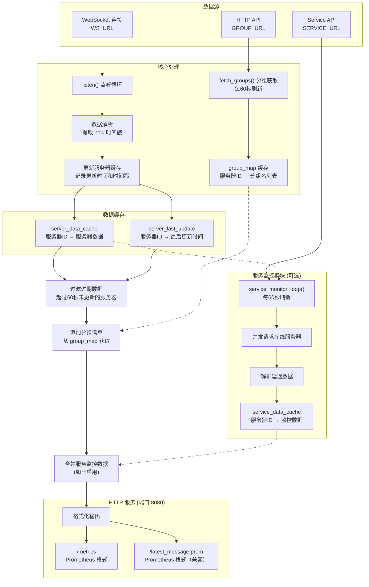
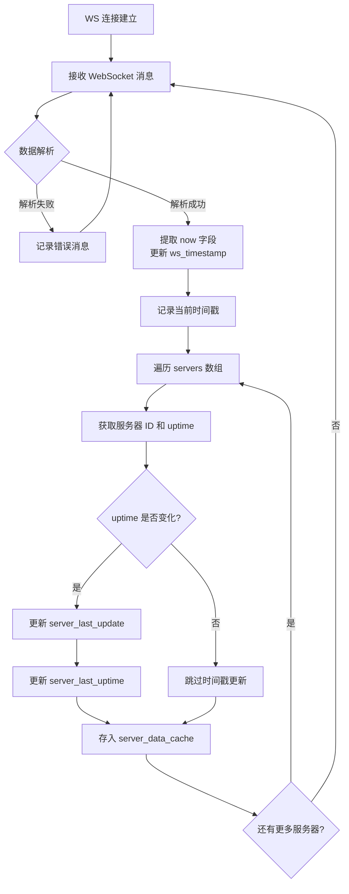
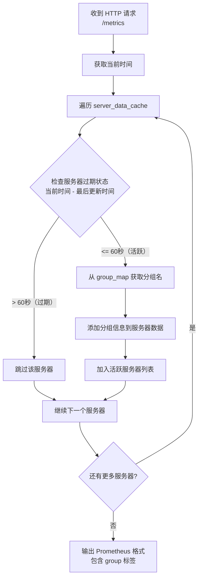
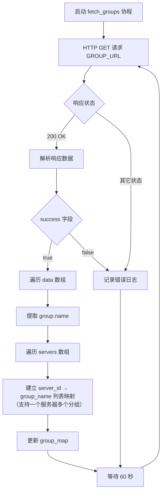
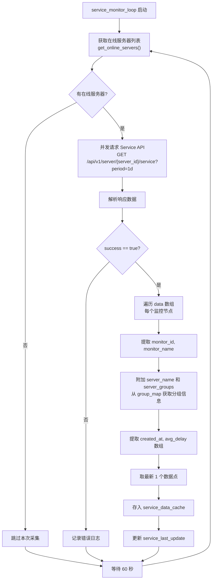
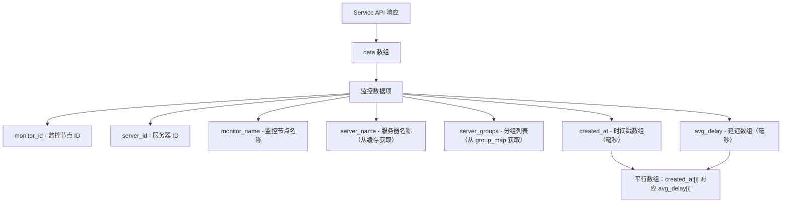
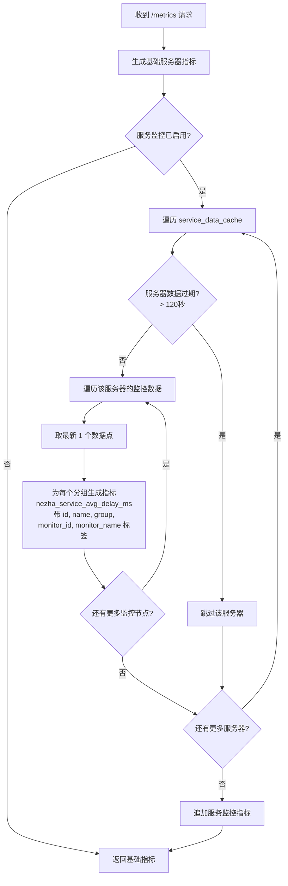

# nezha-exporter 数据处理详细流程

本流程图展示了 NezhaV1-exporter 对 WebSocket 数据的接收、解析、转换及对外接口输出的详细内部流程。

## 整体架构



## 数据过期机制

为了解决服务器离线后 Prometheus 仍拉取到不变旧数据的问题，引入了数据过期机制：

```mermaid
flowchart TD
    subgraph 数据接收 ["WebSocket 数据接收"]
        A["接收 WebSocket 消息"] --> A1["提取 now 字段<br/>更新 ws_timestamp"]
        A1 --> B["解析服务器列表"]
        B --> C["获取当前时间戳"]
        C --> D["遍历每个服务器"]
        D --> D1["获取当前 uptime 值"]
        D1 --> D2{"uptime 是否变化?<br/>对比 server_last_uptime"}
        D2 -- "是（有变化）" --> E["更新 server_last_update 时间戳"]
        D2 -- "否（无变化）" --> F["不更新时间戳"]
        E --> G["存入 server_data_cache"]
        F --> G
    end
    
    subgraph Prometheus请求 ["Prometheus 请求 /metrics"]
        H["收到请求"] --> I["获取当前时间戳"]
        I --> J["遍历 server_data_cache"]
        J --> K{"检查服务器<br/>当前时间 - 最后更新时间"}
        K -- "<= 60秒" --> L["服务器活跃<br/>生成该服务器指标"]
        K -- "> 60秒" --> M["服务器过期<br/>跳过不输出"]
        L --> N["返回指标数据"]
        M --> N
    end
    
    subgraph 效果 ["过期机制效果"]
        O["服务器在线"] --> P["uptime 持续增加"]
        P --> Q["时间戳持续更新<br/>指标正常输出"]
        R["服务器离线"] --> S["uptime 停止变化"]
        S --> T["时间戳不再更新"]
        T --> U["超过60秒后<br/>指标自动移除"]
    end
```



### 过期机制核心逻辑

1. **数据接收时**：每次收到 WebSocket 消息，检查每个服务器的 `uptime` 值是否发生变化
2. **活跃判定**：只有当 `uptime` 发生变化时，才认为服务器真正在线，并更新 `server_last_update` 时间戳
3. **过期判定**：如果 `当前时间 - 最后更新时间 > 60秒`，则该服务器的指标不会出现在返回结果中
4. **自动恢复**：服务器重新上线后，`uptime` 会重新变化，指标自动恢复输出

> **为什么使用 `uptime` 判断？**
> 
> 服务器在线时，`uptime`（运行时间）会持续增加。如果服务器离线，即使 WebSocket 消息仍包含该服务器的数据，`uptime` 也不会再变化。通过检测 `uptime` 是否变化，可以准确判断服务器是否真正在线。

## 详细数据流程

### WebSocket 数据接收与缓存



### 服务器数据字段结构

每个服务器数据包含以下字段：

```mermaid
flowchart TD
    SERVER["服务器数据"] --> BASIC["基础信息"]
    SERVER --> HOST["host 字段"]
    SERVER --> STATE["state 字段"]
    
    BASIC --> B1["id - 服务器ID"]
    BASIC --> B2["name - 服务器名称"]
    BASIC --> B3["group - 分组名列表（来自 group_map）"]
    
    HOST --> H1["boot_time - 启动时间"]
    HOST --> H2["mem_total - 总内存"]
    HOST --> H3["disk_total - 总磁盘"]
    HOST --> H4["swap_total - 总交换分区"]
    
    STATE --> S1["cpu - CPU使用率"]
    STATE --> S2["mem_used - 已用内存"]
    STATE --> S3["swap_used - 已用交换分区"]
    STATE --> S4["disk_used - 已用磁盘"]
    STATE --> S5["net_in_speed - 入站网速"]
    STATE --> S6["net_out_speed - 出站网速"]
    STATE --> S7["net_in_transfer - 入站流量"]
    STATE --> S8["net_out_transfer - 出站流量"]
    STATE --> S9["tcp/udp_conn_count - 连接数"]
    STATE --> S10["process_count - 进程数"]
    STATE --> S11["uptime - 运行时间"]
    STATE --> S12["temperatures - 温度数组"]
```



### 数据生成流程（每次请求时执行）



## 分组信息获取流程



## 服务监控模块流程

服务监控模块（Service Monitor）用于采集各服务器到监控节点的网络延迟数据。

### 服务监控数据获取流程



### 服务监控数据结构



### Prometheus 指标生成流程



## 核心数据结构

| 变量名 | 类型 | 说明 |
|-------|------|------|
| `group_map` | Dict[int, List[str]] | 服务器ID → 分组名列表映射（支持一个服务器属于多个分组） |
| `server_data_cache` | Dict[int, dict] | 服务器ID → 服务器完整数据 |
| `server_last_update` | Dict[int, float] | 服务器ID → 最后更新时间戳（Unix时间） |
| `server_last_uptime` | Dict[int, int] | 服务器ID → 上次 uptime 值（用于检测数据是否真正更新） |
| `ws_online_count` | int | WebSocket 返回的在线人数（原始值，不与服务器关联） |
| `ws_timestamp` | int | WebSocket 返回的时间戳（毫秒级，来自 `now` 字段） |
| `DATA_EXPIRE_SECONDS` | int | 数据过期时间，默认 60 秒 |
| `service_monitor_enabled` | bool | 服务监控功能开关 |

### 服务监控模块数据结构

| 变量名 | 类型 | 说明 |
|-------|------|------|
| `service_data_cache` | Dict[int, List[dict]] | 服务器ID → 监控数据列表 |
| `service_last_update` | Dict[int, float] | 服务器ID → 最后更新时间戳 |
| `SERVICE_DATA_EXPIRE_SECONDS` | int | 服务数据过期时间，默认 120 秒 |
| `SERVICE_DATA_POINTS_COUNT` | int | 每次输出的数据点数量，默认 1 |

## Prometheus 指标说明

所有服务器基础指标均带有毫秒级时间戳（来自 WebSocket 的 `now` 字段），格式为：`metric_name{labels} value timestamp`

| 指标名称 | 类型 | 标签 | 说明 |
|---------|------|------|------|
| `nezha_online` | Gauge | 无 | WebSocket 返回的在线人数（原始值，不与服务器关联） |
| `nezha_online_server` | Gauge | 无 | 经过过期过滤后的活跃服务器数量 |
| `nezha_boot_time` | Gauge | id, name, group | 系统启动时间戳 |
| `nezha_mem_total` | Gauge | id, name, group | 总内存（字节） |
| `nezha_disk_total` | Gauge | id, name, group | 总磁盘空间（字节） |
| `nezha_swap_total` | Gauge | id, name, group | 总交换分区（字节） |
| `nezha_cpu` | Gauge | id, name, group | CPU 使用率（百分比） |
| `nezha_mem_used` | Gauge | id, name, group | 已用内存（字节） |
| `nezha_swap_used` | Gauge | id, name, group | 已用交换分区（字节） |
| `nezha_disk_used` | Gauge | id, name, group | 已用磁盘空间（字节） |
| `nezha_net_in_speed` | Gauge | id, name, group | 入站网络速度（字节/秒） |
| `nezha_net_out_speed` | Gauge | id, name, group | 出站网络速度（字节/秒） |
| `nezha_net_in_transfer` | Counter | id, name, group | 入站总流量（字节） |
| `nezha_net_out_transfer` | Counter | id, name, group | 出站总流量（字节） |
| `nezha_tcp_conn_count` | Gauge | id, name, group | TCP 连接数 |
| `nezha_udp_conn_count` | Gauge | id, name, group | UDP 连接数 |
| `nezha_process_count` | Gauge | id, name, group | 进程数 |
| `nezha_uptime` | Gauge | id, name, group | 运行时间（秒） |
| `nezha_temperature` | Gauge | id, name, group, temp_name | 温度传感器读数（摄氏度） |

**指标输出示例：**

```prometheus
nezha_online 2 1765719627000
nezha_cpu{id="11",name="MoeSG",group="default"} 1.147 1765719627000
nezha_mem_used{id="11",name="MoeSG",group="default"} 632926208 1765719627000
```

### 服务监控指标（需启用 SERVICE_MONITOR_ENABLED）

| 指标名称 | 类型 | 标签 | 说明 |
|---------|------|------|------|
| `nezha_service_avg_delay_ms` | Gauge | id, name, group, monitor_id, monitor_name | 平均网络延迟（毫秒） |

**指标格式：**

```prometheus
nezha_service_avg_delay_ms{id="12",name="MoeGZ",group="默认",monitor_id="2",monitor_name="AWS_SG_ipv6"} 97.018 1765626600000
```

> 时间戳（毫秒级整数）放在数值后面。标签名与基础服务器指标保持一致（id, name, group）。

**服务监控指标标签说明：**

| 标签 | 说明 |
|------|------|
| `id` | 被监控的服务器 ID |
| `name` | 被监控的服务器名称 |
| `group` | 服务器分组（支持多分组，每个分组输出一条指标） |
| `monitor_id` | 监控节点 ID |
| `monitor_name` | 监控节点名称（如 AWS_SG_ipv6、广州移动 等） |

> **注意**：
> - 所有指标均带有毫秒级时间戳（来自 WebSocket 的 `now` 字段）
> - 当服务器离线超过 60 秒后，该服务器的所有指标将自动从 `/metrics` 端点的输出中移除
> - 服务监控数据过期时间为 120 秒
> - 每个监控节点输出最新 1 个数据点

## 环境变量配置

| 变量名 | 必填 | 说明 |
|-------|------|------|
| `WS_URL` | 是 | 哪吒监控 WebSocket 地址 |
| `GROUP_URL` | 是 | 分组信息 API 地址 |
| `SERVICE_MONITOR_ENABLED` | 否 | 服务监控功能开关（`true`/`false`，默认 `false`） |
| `SERVICE_URL` | 否* | 服务监控 API 地址（*当 `SERVICE_MONITOR_ENABLED=true` 时必填） |
| `AUTH_USERNAME` | 否 | Basic Auth 用户名（与 `AUTH_PASSWORD` 同时设置时生效） |
| `AUTH_PASSWORD` | 否 | Basic Auth 密码（与 `AUTH_USERNAME` 同时设置时生效） |

## HTTP 端点

| 端点路径 | 响应类型 | 说明 |
|---------|---------|------|
| `/metrics` | text/plain | 返回 Prometheus 格式的指标数据（已过滤过期服务器，包含分组标签） |
| `/latest_message.prom` | text/plain | 同 `/metrics`，兼容旧版 |

## 错误处理

- WebSocket 连接断开或失败时，自动每 5 秒重连
- 分组信息获取失败时，记录日志并在下一个周期重试
- 数据未就绪时，HTTP 端点返回 503 状态码和 "No data yet" 消息
- **服务器离线超过 60 秒后，其数据自动从 Prometheus 输出中移除**

## 版本历史

| 版本 | 更新内容 |
|------|---------|
| v0.0.0 | 初始版本 |
| v0.0.1 | 添加数据过期机制，服务器离线超过60秒后自动移除其指标数据 |
| v0.0.2 | 优化离线检测：使用 `uptime` 变化判断服务器是否真正在线 |
| v0.0.3 | 添加 HTTP Basic Auth 认证支持（可选），兼容不同版本 websockets 库 |
| v0.0.4 | 将 `nezha_online` 改为 WebSocket 返回的原始在线人数，新增 `nezha_online_server` 表示活跃服务器数量 |
| v0.0.5 | 添加服务器分组信息支持 |
| v0.0.6 | 修复认证参数传递问题（从全局变量改为函数参数传递），添加更详细的调试日志 |
| v0.0.7 | 支持主机属于多个分组，group_map 改为服务器ID到分组名列表映射，Prometheus 指标为每个分组单独输出 |
| v0.1.1 | 新增服务监控功能（Service Monitor），采集服务器到监控节点的网络延迟数据，支持通过环境变量开关；服务监控指标标签与基础指标统一（id, name, group）；移除 JSON 输出端点，仅保留 Prometheus 格式输出 |
| v0.1.2 | 为所有服务器基础指标添加时间戳支持，时间戳来自 WebSocket 的 `now` 字段（毫秒级），与服务监控指标格式保持一致 |
| v0.1.3 | 服务监控数据点数量从 3 改为 1，只返回最新的一个数据点 |

## 文档流程图注意规格：
> **⚠️ Mermaid 语法注意事项**
> 
> 编写 Mermaid 流程图时，如果节点标签包含以下特殊字符，必须用双引号 `""` 括起来：
> - 问号 `?`
> - 比较符号 `>` `<` `>=` `<=`
> - 乘号 `×` （建议用字母 `x` 替代）
> - 百分号 `%`
> 
> **正确示例**：`A{"是否继续?"}` `B{"值 > 100"}`
> 
> **错误示例**：`A{是否继续?}` `B{值>100}`
