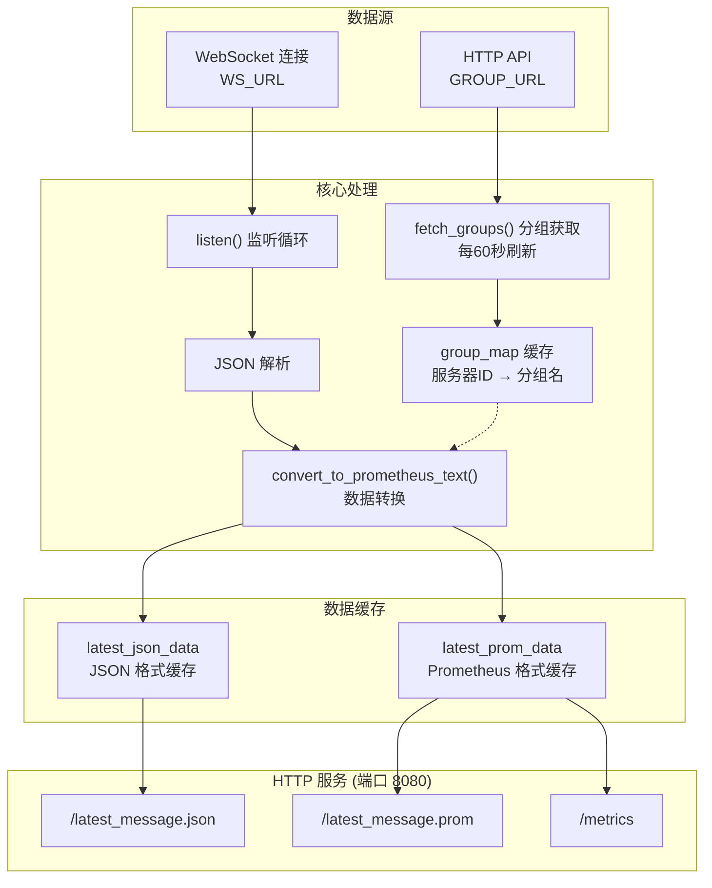
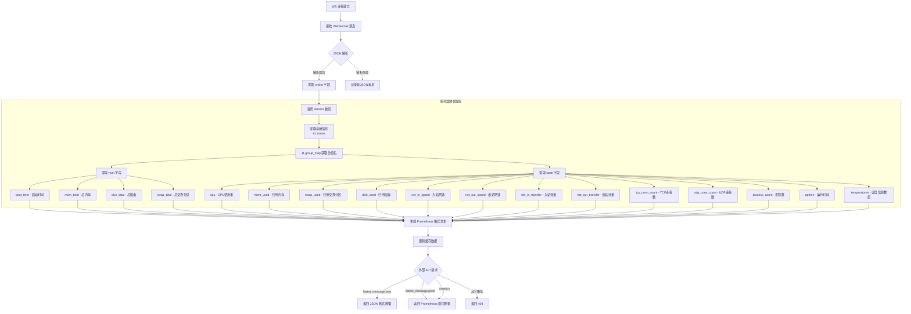
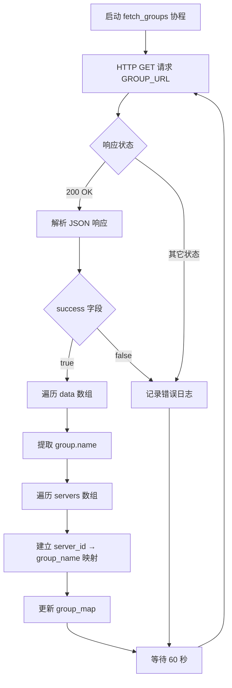

# nezha-exporter 数据处理详细流程

本流程图展示了 NezhaV1-exporter 对 WebSocket 数据的接收、解析、转换及对外接口输出的详细内部流程。

## 整体架构

## 详细数据流程

## 分组信息获取流程

## Prometheus 指标说明

| 指标名称 | 类型 | 标签 | 说明 |
|---------|------|------|------|
| `nezha_online` | Gauge | 无 | 在线服务器数量 |
| `nezha_boot_time` | Gauge | id, name, group | 系统启动时间戳 |
| `nezha_mem_total` | Gauge | id, name, group | 总内存（字节） |
| `nezha_disk_total` | Gauge | id, name, group | 总磁盘空间（字节） |
| `nezha_swap_total` | Gauge | id, name, group | 总交换分区（字节） |
| `nezha_cpu` | Gauge | id, name, group | CPU 使用率（百分比） |
| `nezha_mem_used` | Gauge | id, name, group | 已用内存（字节） |
| `nezha_swap_used` | Gauge | id, name, group | 已用交换分区（字节） |
| `nezha_disk_used` | Gauge | id, name, group | 已用磁盘空间（字节） |
| `nezha_net_in_speed` | Gauge | id, name, group | 入站网络速度（字节/秒） |
| `nezha_net_out_speed` | Gauge | id, name, group | 出站网络速度（字节/秒） |
| `nezha_net_in_transfer` | Counter | id, name, group | 入站总流量（字节） |
| `nezha_net_out_transfer` | Counter | id, name, group | 出站总流量（字节） |
| `nezha_tcp_conn_count` | Gauge | id, name, group | TCP 连接数 |
| `nezha_udp_conn_count` | Gauge | id, name, group | UDP 连接数 |
| `nezha_process_count` | Gauge | id, name, group | 进程数 |
| `nezha_uptime` | Gauge | id, name, group | 运行时间（秒） |
| `nezha_temperature` | Gauge | id, name, group, temp_name | 温度传感器读数（摄氏度） |

## 环境变量配置

| 变量名 | 必填 | 说明 |
|-------|------|------|
| `WS_URL` | 是 | 哪吒监控 WebSocket 地址 |
| `GROUP_URL` | 是 | 分组信息 API 地址 |

## HTTP 端点

| 端点路径 | 响应类型 | 说明 |
|---------|---------|------|
| `/latest_message.json` | application/json | 返回最新的原始 JSON 数据 |
| `/latest_message.prom` | text/plain | 返回 Prometheus 格式的指标数据 |
| `/metrics` | text/plain | 同 `/latest_message.prom`，用于 Prometheus 抓取 |

## 错误处理

- WebSocket 连接断开或失败时，自动每 5 秒重连
- 分组信息获取失败时，记录日志并在下一个周期重试
- 数据未就绪时，HTTP 端点返回 503 状态码和 "No data yet" 消息

## 文档流程图注意规格：
> **⚠️ Mermaid 语法注意事项**
> 
> 编写 Mermaid 流程图时，如果节点标签包含以下特殊字符，必须用双引号 `""` 括起来：
> - 问号 `?`
> - 比较符号 `>` `<` `>=` `<=`
> - 乘号 `×` （建议用字母 `x` 替代）
> - 百分号 `%`
> 
> **正确示例**：`A{"是否继续?"}` `B{"值 > 100"}`
> 
> **错误示例**：`A{是否继续?}` `B{值>100}`