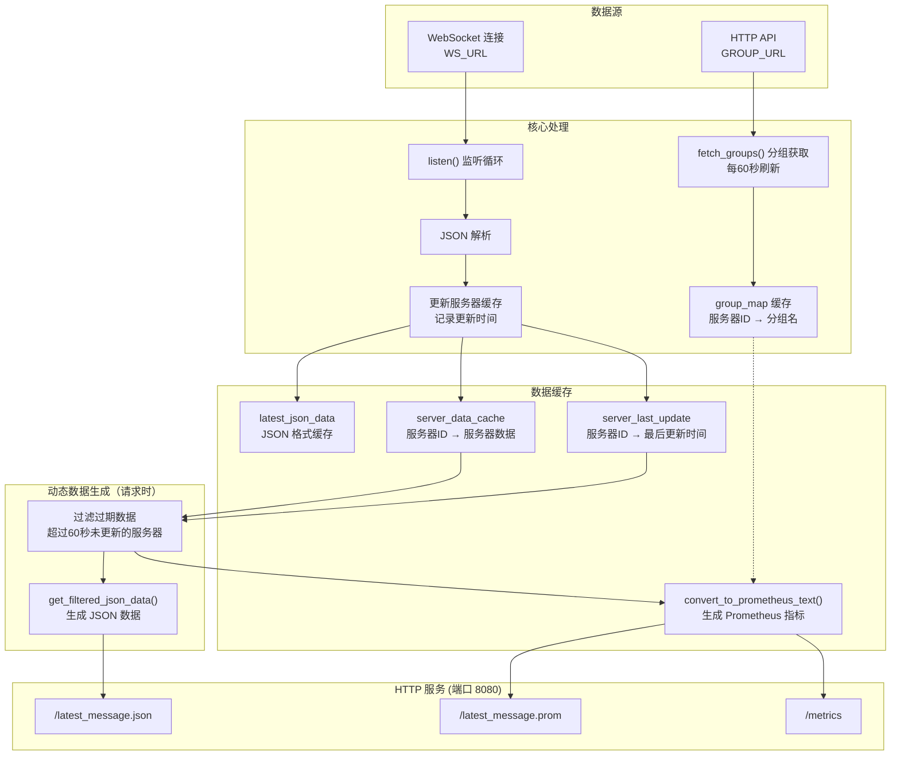
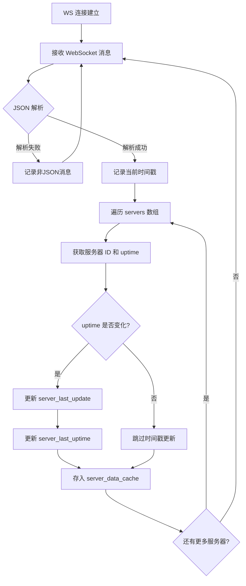
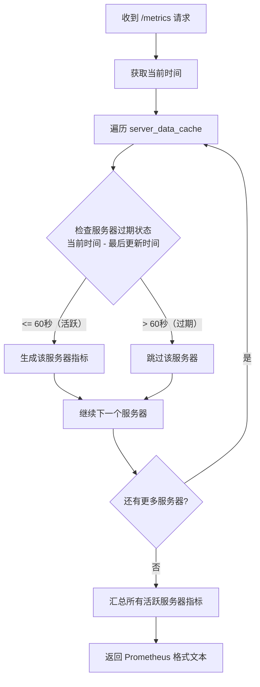
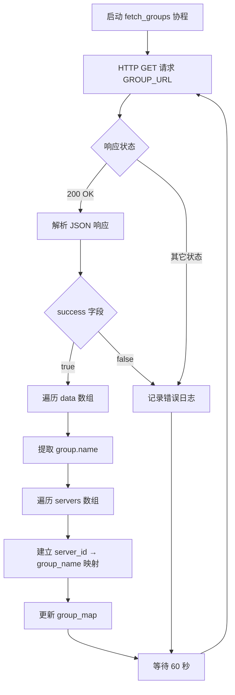

# nezha-exporter 数据处理详细流程

本流程图展示了 NezhaV1-exporter 对 WebSocket 数据的接收、解析、转换及对外接口输出的详细内部流程。

## 整体架构

## 数据过期机制

为了解决服务器离线后 Prometheus 仍拉取到不变旧数据的问题，引入了数据过期机制：

```mermaid
flowchart TD
    subgraph 数据接收 ["WebSocket 数据接收"]
        A["接收 WebSocket 消息"] --> B["解析服务器列表"]
        B --> C["获取当前时间戳"]
        C --> D["遍历每个服务器"]
        D --> D1["获取当前 uptime 值"]
        D1 --> D2{"uptime 是否变化?<br/>对比 server_last_uptime"}
        D2 -- "是（有变化）" --> E["更新 server_last_update 时间戳"]
        D2 -- "否（无变化）" --> F["不更新时间戳"]
        E --> G["存入 server_data_cache"]
        F --> G
    end
    
    subgraph Prometheus请求 ["Prometheus 请求 /metrics"]
        H["收到请求"] --> I["获取当前时间戳"]
        I --> J["遍历 server_data_cache"]
        J --> K{"检查服务器<br/>当前时间 - 最后更新时间"}
        K -- "<= 60秒" --> L["服务器活跃<br/>生成该服务器指标"]
        K -- "> 60秒" --> M["服务器过期<br/>跳过不输出"]
        L --> N["返回指标数据"]
        M --> N
    end
    
    subgraph 效果 ["过期机制效果"]
        O["服务器在线"] --> P["uptime 持续增加"]
        P --> Q["时间戳持续更新<br/>指标正常输出"]
        R["服务器离线"] --> S["uptime 停止变化"]
        S --> T["时间戳不再更新"]
        T --> U["超过60秒后<br/>指标自动移除"]
    end
```

### 过期机制核心逻辑

1. **数据接收时**：每次收到 WebSocket 消息，检查每个服务器的 `uptime` 值是否发生变化
2. **活跃判定**：只有当 `uptime` 发生变化时，才认为服务器真正在线，并更新 `server_last_update` 时间戳
3. **过期判定**：如果 `当前时间 - 最后更新时间 > 60秒`，则该服务器的指标不会出现在返回结果中
4. **自动恢复**：服务器重新上线后，`uptime` 会重新变化，指标自动恢复输出

> **为什么使用 `uptime` 判断？**
> 
> 服务器在线时，`uptime`（运行时间）会持续增加。如果服务器离线，即使 WebSocket 消息仍包含该服务器的数据，`uptime` 也不会再变化。通过检测 `uptime` 是否变化，可以准确判断服务器是否真正在线。

## 详细数据流程

### WebSocket 数据接收与缓存

### 服务器数据字段结构

每个服务器数据包含以下字段：

```mermaid
flowchart TD
    SERVER["服务器数据"] --> BASIC["基础信息"]
    SERVER --> HOST["host 字段"]
    SERVER --> STATE["state 字段"]
    
    BASIC --> B1["id - 服务器ID"]
    BASIC --> B2["name - 服务器名称"]
    BASIC --> B3["group - 分组名（来自 group_map）"]
    
    HOST --> H1["boot_time - 启动时间"]
    HOST --> H2["mem_total - 总内存"]
    HOST --> H3["disk_total - 总磁盘"]
    HOST --> H4["swap_total - 总交换分区"]
    
    STATE --> S1["cpu - CPU使用率"]
    STATE --> S2["mem_used - 已用内存"]
    STATE --> S3["swap_used - 已用交换分区"]
    STATE --> S4["disk_used - 已用磁盘"]
    STATE --> S5["net_in_speed - 入站网速"]
    STATE --> S6["net_out_speed - 出站网速"]
    STATE --> S7["net_in_transfer - 入站流量"]
    STATE --> S8["net_out_transfer - 出站流量"]
    STATE --> S9["tcp/udp_conn_count - 连接数"]
    STATE --> S10["process_count - 进程数"]
    STATE --> S11["uptime - 运行时间"]
    STATE --> S12["temperatures - 温度数组"]
```

### 指标生成流程（每次请求时执行）

## 分组信息获取流程

## 核心数据结构

| 变量名 | 类型 | 说明 |
|-------|------|------|
| `group_map` | Dict[int, str] | 服务器ID → 分组名映射 |
| `server_data_cache` | Dict[int, dict] | 服务器ID → 服务器完整数据 |
| `server_last_update` | Dict[int, float] | 服务器ID → 最后更新时间戳（Unix时间） |
| `server_last_uptime` | Dict[int, int] | 服务器ID → 上次 uptime 值（用于检测数据是否真正更新） |
| `latest_json_data` | str | 最新的原始 JSON 数据字符串 |
| `DATA_EXPIRE_SECONDS` | int | 数据过期时间，默认 60 秒 |

## Prometheus 指标说明

| 指标名称 | 类型 | 标签 | 说明 |
|---------|------|------|------|
| `nezha_online` | Gauge | 无 | 在线用户数 |
| `nezha_boot_time` | Gauge | id, name, group | 系统启动时间戳 |
| `nezha_mem_total` | Gauge | id, name, group | 总内存（字节） |
| `nezha_disk_total` | Gauge | id, name, group | 总磁盘空间（字节） |
| `nezha_swap_total` | Gauge | id, name, group | 总交换分区（字节） |
| `nezha_cpu` | Gauge | id, name, group | CPU 使用率（百分比） |
| `nezha_mem_used` | Gauge | id, name, group | 已用内存（字节） |
| `nezha_swap_used` | Gauge | id, name, group | 已用交换分区（字节） |
| `nezha_disk_used` | Gauge | id, name, group | 已用磁盘空间（字节） |
| `nezha_net_in_speed` | Gauge | id, name, group | 入站网络速度（字节/秒） |
| `nezha_net_out_speed` | Gauge | id, name, group | 出站网络速度（字节/秒） |
| `nezha_net_in_transfer` | Counter | id, name, group | 入站总流量（字节） |
| `nezha_net_out_transfer` | Counter | id, name, group | 出站总流量（字节） |
| `nezha_tcp_conn_count` | Gauge | id, name, group | TCP 连接数 |
| `nezha_udp_conn_count` | Gauge | id, name, group | UDP 连接数 |
| `nezha_process_count` | Gauge | id, name, group | 进程数 |
| `nezha_uptime` | Gauge | id, name, group | 运行时间（秒） |
| `nezha_temperature` | Gauge | id, name, group, temp_name | 温度传感器读数（摄氏度） |

> **注意**：当服务器离线超过 60 秒后，该服务器的所有指标将自动从 `/metrics` 端点的输出中移除，Prometheus 不会再拉取到该服务器的过期数据。

## 环境变量配置

| 变量名 | 必填 | 说明 |
|-------|------|------|
| `WS_URL` | 是 | 哪吒监控 WebSocket 地址 |
| `GROUP_URL` | 是 | 分组信息 API 地址 |

## HTTP 端点

| 端点路径 | 响应类型 | 说明 |
|---------|---------|------|
| `/latest_message.json` | application/json | 返回 JSON 格式数据（已过滤过期服务器） |
| `/latest_message.prom` | text/plain | 返回 Prometheus 格式的指标数据（已过滤过期服务器） |
| `/metrics` | text/plain | 同 `/latest_message.prom`，用于 Prometheus 抓取 |

## 错误处理

- WebSocket 连接断开或失败时，自动每 5 秒重连
- 分组信息获取失败时，记录日志并在下一个周期重试
- 数据未就绪时，HTTP 端点返回 503 状态码和 "No data yet" 消息
- **服务器离线超过 60 秒后，其数据自动从所有端点（JSON 和 Prometheus）的输出中移除**

## 版本历史

| 版本 | 更新内容 |
|------|---------|
| 0.0.0 | 初始版本 |
| 0.0.1 | 添加数据过期机制，服务器离线超过60秒后自动移除其指标数据 |
| 0.0.2 | 优化离线检测：使用 `uptime` 变化判断服务器是否真正在线 |

## 文档流程图注意规格：
> **⚠️ Mermaid 语法注意事项**
> 
> 编写 Mermaid 流程图时，如果节点标签包含以下特殊字符，必须用双引号 `""` 括起来：
> - 问号 `?`
> - 比较符号 `>` `<` `>=` `<=`
> - 乘号 `×` （建议用字母 `x` 替代）
> - 百分号 `%`
> 
> **正确示例**：`A{"是否继续?"}` `B{"值 > 100"}`
> 
> **错误示例**：`A{是否继续?}` `B{值>100}`
